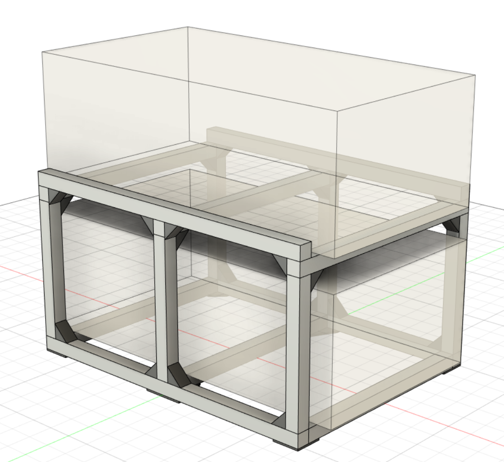
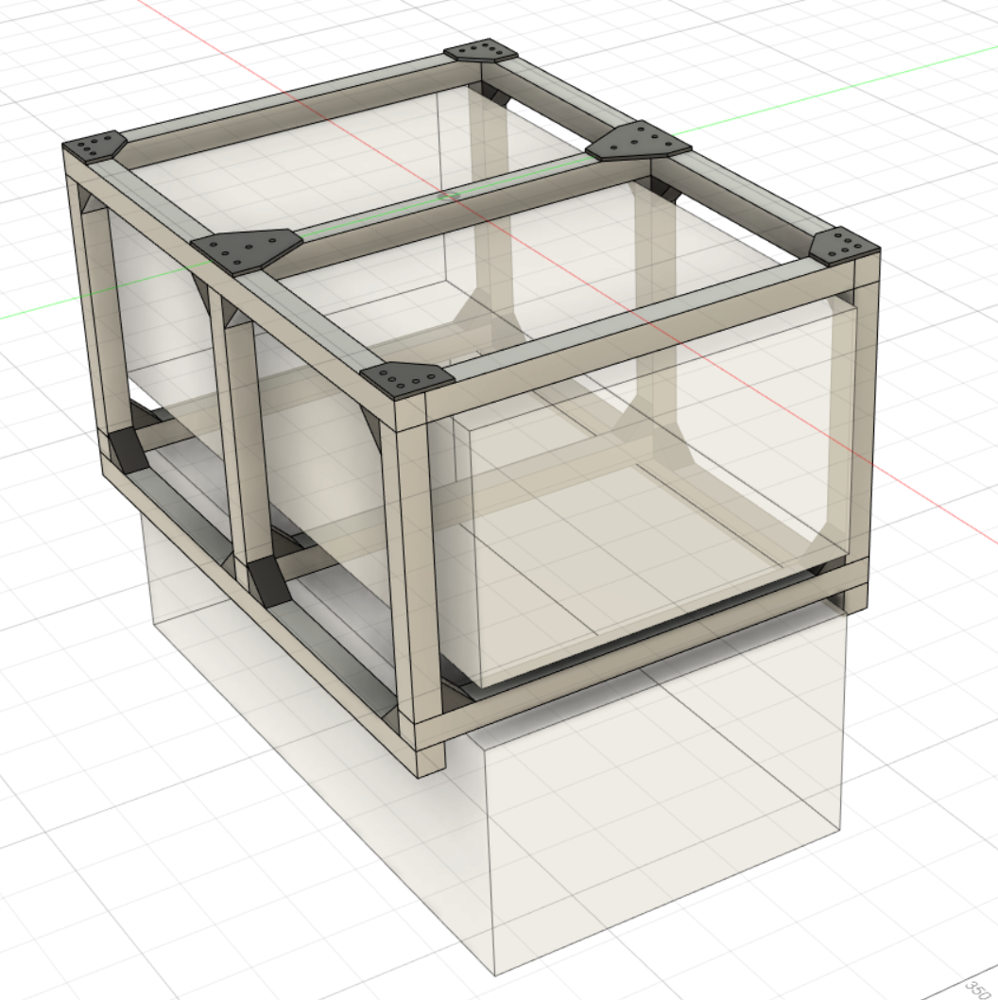
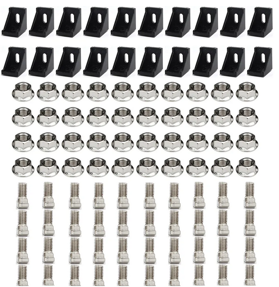
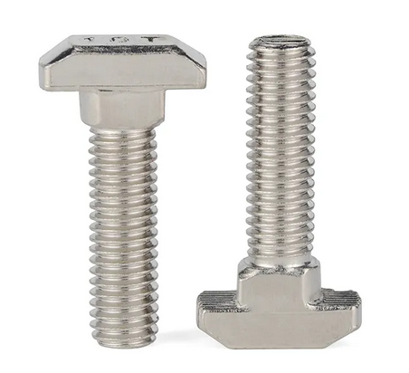
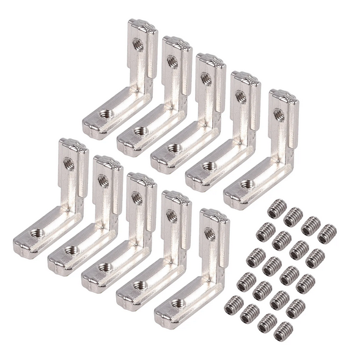
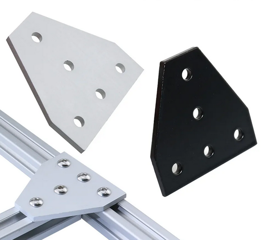
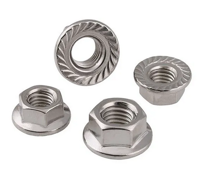
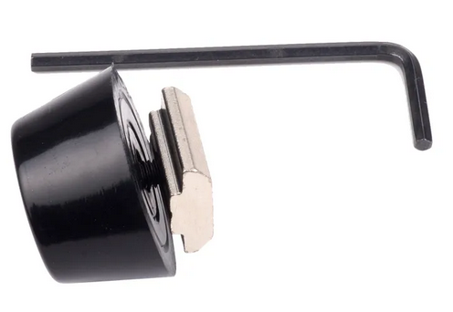
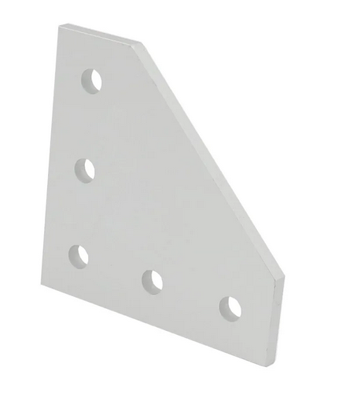

# Batterie Regal

Eine kurze Anleitung zum Bau eine Regals aus Aluminiumprofilen zur Unterbringung von Batterie Racks.

## Design Bilder

## Darstellung 

Die Autodesk datei kann [hier heruntergeladen][f3d] werden oder direkt im browser gerendert werden: [Autodesk Galley][a360]

## Materialliste

Ich habe bei folgender Firma bestellt: [myaluprofil.de][myaluprofil]. Der Warenwert war 120.- Euro plus Versand.

| Anzahl | Artikel                                  | Type  | Länge  |
|--------|------------------------------------------|-------|--------|
| 2      | Aluminiumprofil 30x30 Nut 6 I-Typ Leicht | 2N180 | 700 mm |
| 3      | Aluminiumprofil 30x30 Nut 6 I-Typ Leicht | 3N    | 460 mm |
| 2      | Aluminiumprofil 30x30 Nut 6 I-Typ Leicht | 1N    | 300 mm |
| 4      | Aluminiumprofil 30x30 Nut 6 I-Typ Leicht | 2N90  | 300 mm |
| 2      | Aluminiumprofil 30x30 Nut 6 I-Typ Leicht | 2N90  | 520 mm |
| 1      | Aluminiumprofil 30x30 Nut 6 I-Typ Leicht | 1N    | 520 mm |
| 2      | Aluminiumprofil 30x30 Nut 6 I-Typ Leicht | 3N    | 700 mm |

Folgendes habe ich direkt in China bestellt via [Aliexpress][aliexpress]. Der Warenwert war 85.- Euro. Bitte achte auf die Beschreibung, manchmal sind es Sets die hier gelistet sind.

| Bild                                                                      | Anzahl | Beschreibung                                                                                                              |
|---------------------------------------------------------------------------|--------|---------------------------------------------------------------------------------------------------------------------------|
|       | 1      | 3030 Aluminum Profile Connector Set: 20pcs 3030 Corner Bracket + 40pcs M6 x 16mm T Bolt Screws + 40pcs M6 Hex Flange Nuts |
|                | 4      | M6 T Hammer Head T Bolt Aluminum Connector T head bolts Screws for 30 Aluminum Profiles                                   |
|  | 1      | 10pcs T Slot L-Shape Interior Corner Connector Joint Bracket 3030 with screws Aluminum Profile Extrusion Connector        |
|    | 2      | Strong Corner Angle Bracket Connection Joint Strip Board for V-slot Aluminum Profile 3030 with 5 holes                    |
|                      | 1      | 50pcs DIN6923 Flange Nuts M6 304 Stainless Steel Hex Lock Self-Locking Metric Thread Serrated Nut                         |
|              | 1      | 8 Sets Antivibration Feet Anti-vibration Rubber Landing Mat Feet For Prusa i3 MK3 Kit For 3030 Profile 3d Printer Parts   |
|              | 4      | 3030 with 5 hole L T type 90 Degree Joint Board Plate Corner Angle Bracket Connection for Aluminum Profile                |

[myaluprofil]: https://www.myaluprofil.de
[aliexpress]: https://www.aliexpress.com
[f3d]: BatteryRackV4.f3d
[a360}: https://a360.co/3yKJpqY
